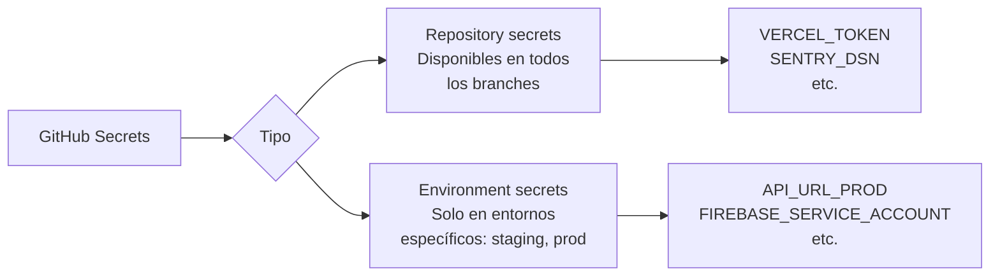
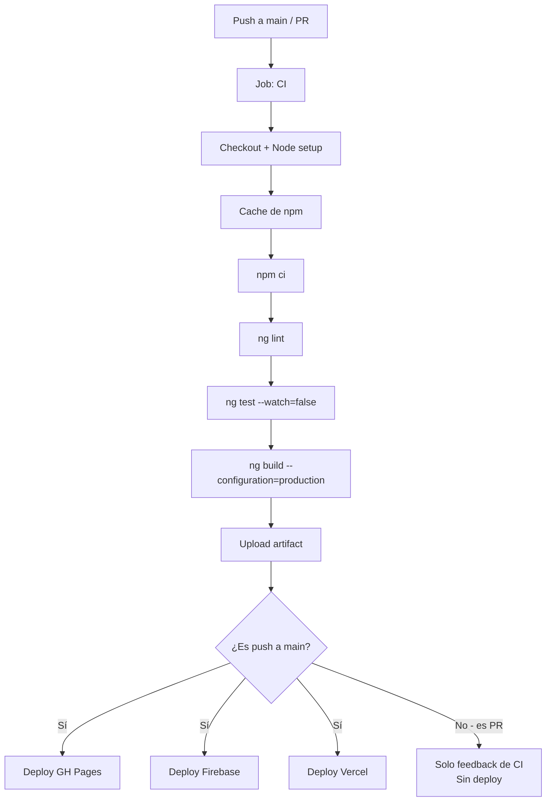

# Capítulo 35 - Parte 2: CI/CD con GitHub Actions: build, test y deploy automático

> **Parte 2 de 4** · Capítulo 35 · PARTE XIV - Arquitectura y Patrones Avanzados

Un pipeline de integración y entrega continua es lo que separa a un proyecto hobby de un proyecto profesional. Con CI/CD, cada push a main dispara automáticamente el build, los tests y el deploy. Construiremos un workflow completo con GitHub Actions que cubre desde el lint hasta el deploy en tres plataformas distintas.

## Estructura del workflow

GitHub Actions lee archivos YAML en `.github/workflows/`. Creamos el archivo principal:

```bash
mkdir -p .github/workflows
```

```yaml
# .github/workflows/ci.yml
name: CI/CD Pipeline

on:
  push:
    branches: [main, develop]
  pull_request:
    branches: [main]

env:
  NODE_VERSION: '20'
  CACHE_KEY: 'npm-cache-v1'

jobs:
  ci:
    name: Integración Continua
    runs-on: ubuntu-latest
    steps:
      - name: Checkout del código
        uses: actions/checkout@v4

      - name: Configurar Node.js ${{ env.NODE_VERSION }}
        uses: actions/setup-node@v4
        with:
          node-version: ${{ env.NODE_VERSION }}

      - name: Restaurar caché de dependencias
        uses: actions/cache@v4
        with:
          path: ~/.npm
          key: ${{ env.CACHE_KEY }}-${{ hashFiles('**/package-lock.json') }}
          restore-keys: |
            ${{ env.CACHE_KEY }}-

      - name: Instalar dependencias
        run: npm ci

      - name: Lint
        run: npx ng lint

      - name: Tests unitarios
        run: npx ng test --watch=false --browsers=ChromeHeadless --code-coverage

      - name: Build de producción
        run: npx ng build --configuration=production
        env:
          # Variables inyectadas desde GitHub Secrets
          API_URL: ${{ secrets.API_URL_PROD }}

      - name: Subir artefacto del build
        uses: actions/upload-artifact@v4
        with:
          name: build-produccion
          path: dist/
          retention-days: 7
```

### Caché de `node_modules`

La caché de npm es uno de los cambios más impactantes en velocidad de pipeline. Con `actions/cache` y el hash del `package-lock.json`, las dependencias solo se reinstalan cuando el lockfile cambia. Un proyecto mediano pasa de 2-3 minutos a 20-30 segundos en la instalación.

La clave incluye el hash del lockfile: si `package-lock.json` cambia (nueva dependencia), la clave cambia y se reinstala todo. Si el lockfile no cambió, se usa la caché y se salta el `npm ci`.

## Job de deploy a GitHub Pages

```yaml
# Continúa el mismo ci.yml
  deploy-gh-pages:
    name: Deploy a GitHub Pages
    needs: ci
    runs-on: ubuntu-latest
    # Solo desplegamos desde main, no desde PRs
    if: github.ref == 'refs/heads/main' && github.event_name == 'push'
    permissions:
      contents: write

    steps:
      - name: Checkout del código
        uses: actions/checkout@v4

      - name: Descargar artefacto del build
        uses: actions/download-artifact@v4
        with:
          name: build-produccion
          path: dist/

      - name: Deploy a GitHub Pages
        uses: peaceiris/actions-gh-pages@v4
        with:
          github_token: ${{ secrets.GITHUB_TOKEN }}
          publish_dir: dist/mi-app/browser
          # Para apps con router de HTML5, necesitamos un 404.html
          # que redirija al index.html
          enable_jekyll: false
```

GitHub Pages no soporta el routing de HTML5 por defecto (no tiene un servidor que redirija todas las rutas al `index.html`). El truco es copiar `index.html` como `404.html` y usar un script en `index.html` que procese el redirect. Alternativamente, usar `HashLocationStrategy` en Angular, aunque no es lo ideal para URLs limpias.

## Deploy a Firebase Hosting

Firebase Hosting maneja el SPA routing correctamente con una línea en su configuración:

```json
// firebase.json
{
  "hosting": {
    "public": "dist/mi-app/browser",
    "ignore": ["firebase.json", "**/.*", "**/node_modules/**"],
    "rewrites": [
      {
        "source": "**",
        "destination": "/index.html"
      }
    ],
    "headers": [
      {
        "source": "**/*.@(js|css)",
        "headers": [
          { "key": "Cache-Control", "value": "max-age=31536000" }
        ]
      }
    ]
  }
}
```

```yaml
# Job de deploy a Firebase
  deploy-firebase:
    name: Deploy a Firebase Hosting
    needs: ci
    runs-on: ubuntu-latest
    if: github.ref == 'refs/heads/main' && github.event_name == 'push'

    steps:
      - name: Checkout del código
        uses: actions/checkout@v4

      - name: Descargar artefacto del build
        uses: actions/download-artifact@v4
        with:
          name: build-produccion
          path: dist/

      - name: Deploy a Firebase Hosting
        uses: FirebaseExtended/action-hosting-deploy@v0
        with:
          repoToken: ${{ secrets.GITHUB_TOKEN }}
          firebaseServiceAccount: ${{ secrets.FIREBASE_SERVICE_ACCOUNT }}
          channelId: live
          projectId: mi-proyecto-firebase
```

El `FIREBASE_SERVICE_ACCOUNT` es un JSON de cuenta de servicio de Google Cloud, guardado como secret en GitHub. Se genera desde la consola de Firebase: Configuración → Cuentas de servicio → Generar nueva clave privada.

## Deploy a Vercel

Vercel detecta automáticamente Angular y configura el routing correctamente:

```yaml
  deploy-vercel:
    name: Deploy a Vercel
    needs: ci
    runs-on: ubuntu-latest
    if: github.ref == 'refs/heads/main' && github.event_name == 'push'

    steps:
      - name: Checkout del código
        uses: actions/checkout@v4

      - name: Configurar Node.js
        uses: actions/setup-node@v4
        with:
          node-version: ${{ env.NODE_VERSION }}

      - name: Instalar Vercel CLI
        run: npm install -g vercel@latest

      - name: Deploy a Vercel Production
        run: |
          vercel pull --yes --environment=production \
            --token=${{ secrets.VERCEL_TOKEN }}
          vercel build --prod --token=${{ secrets.VERCEL_TOKEN }}
          vercel deploy --prebuilt --prod \
            --token=${{ secrets.VERCEL_TOKEN }}
        env:
          VERCEL_ORG_ID: ${{ secrets.VERCEL_ORG_ID }}
          VERCEL_PROJECT_ID: ${{ secrets.VERCEL_PROJECT_ID }}
```

## Gestión de GitHub Secrets

Todos los valores sensibles (tokens, service accounts, DSNs) van en GitHub Secrets, nunca en el YAML del workflow:



Para configurarlos: Settings → Secrets and variables → Actions → New repository secret. En workflows, se referencian como `${{ secrets.NOMBRE_DEL_SECRET }}`.

## Workflow completo integrado: resumen del flujo



## Configurar el `angular.json` para CI

En entornos CI, queremos que los tests fallen inmediatamente si hay un error, sin quedarse esperando interacción del usuario:

```json
// angular.json - configuración de test para CI
{
  "test": {
    "options": {
      "karmaConfig": "karma.conf.js"
    },
    "configurations": {
      "ci": {
        "browsers": "ChromeHeadless",
        "watch": false,
        "progress": false,
        "codeCoverage": true
      }
    }
  }
}
```

Y en el workflow usamos `ng test --configuration=ci` para aprovechar esta configuración.

## Verificar el reporte de cobertura

Si queremos que el pipeline falle cuando la cobertura baja del umbral definido, configuramos el umbral en `karma.conf.js`:

```javascript
// karma.conf.js
module.exports = function (config) {
  config.set({
    coverageReporter: {
      dir: require('path').join(__dirname, './coverage'),
      subdir: '.',
      reporters: [{ type: 'html' }, { type: 'text-summary' }],
      check: {
        global: {
          statements: 80,
          branches: 75,
          functions: 80,
          lines: 80,
        },
      },
    },
  });
};
```

## Puntos clave

- `actions/cache` con `hashFiles('**/package-lock.json')` como clave reduce el tiempo de instalación de dependencias de minutos a segundos en la mayoría de los runs.
- `needs: ci` en los jobs de deploy crea una dependencia: el deploy solo corre si el job `ci` pasó exitosamente.
- La condición `if: github.ref == 'refs/heads/main' && github.event_name == 'push'` garantiza que los deploys ocurran solo desde la rama principal, no desde PRs.
- GitHub Secrets almacena los tokens y credenciales; se referencian con `${{ secrets.NOMBRE }}` y nunca quedan en logs ni en el código fuente.
- `actions/upload-artifact` y `actions/download-artifact` comparten el build entre jobs sin repetir la compilación.

## ¿Qué sigue?

En la siguiente parte containerizamos la app Angular con Docker y exploraremos cómo desplegarla en plataformas cloud como GCP Cloud Run y AWS ECS.
