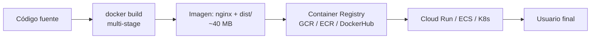

# Capítulo 35 - Parte 3: Dockerización de apps Angular y deploy en cloud

> **Parte 3 de 4** · Capítulo 35 · PARTE XIV - Arquitectura y Patrones Avanzados

Contenerizar una app Angular resuelve el problema clásico de "en mi máquina funciona". Un contenedor Docker encapsula la app junto con su servidor web y configuración, garantizando comportamiento idéntico en desarrollo, staging y producción. Para una SPA de Angular, el contenedor final es notablemente pequeño: unos pocos megabytes de Nginx más los archivos estáticos del build.

## La estrategia multi-stage

Un error común es usar la misma imagen para construir y servir la app. La imagen de Node con todas las `devDependencies` puede superar los 800 MB. La estrategia multi-stage resuelve esto usando dos imágenes:

1. **Stage builder**: imagen Node donde se ejecuta `npm ci` y `ng build`
2. **Stage serve**: imagen Nginx mínima que solo recibe los archivos estáticos del build

```dockerfile
# ── Stage 1: Compilación ────────────────────────────────────────────
FROM node:20-alpine AS builder

WORKDIR /app

# Copiar primero solo los manifiestos para aprovechar la caché de Docker
# (las dependencias solo se reinstalan si package.json cambia)
COPY package.json package-lock.json ./
RUN npm ci --prefer-offline

# Copiar el resto del código fuente
COPY . .

# Build de producción (usa esbuild internamente en Angular 17+)
RUN npx ng build --configuration=production

# ── Stage 2: Servidor ───────────────────────────────────────────────
FROM nginx:1.25-alpine AS server

# Copiar los archivos estáticos del build al directorio de Nginx
COPY --from=builder /app/dist/mi-app/browser /usr/share/nginx/html

# Copiar configuración personalizada de Nginx
COPY nginx.conf /etc/nginx/conf.d/default.conf

# Puerto estándar HTTP (no usar 80 en cloud si el runtime lo asigna)
EXPOSE 80

CMD ["nginx", "-g", "daemon off;"]
```

La imagen final resultante tiene menos de 50 MB en la mayoría de proyectos.

## Configuración de Nginx para SPA

Angular Router usa History API para la navegación. Sin configuración especial, Nginx retorna 404 al acceder directamente a rutas como `/productos/123` porque ese path no corresponde a ningún archivo físico. La solución es el `try_files` que redirige todo al `index.html`:

```nginx
# nginx.conf
server {
    listen 80;
    server_name _;

    root /usr/share/nginx/html;
    index index.html;

    # Compresión gzip para los assets de Angular
    gzip on;
    gzip_types text/plain application/javascript application/json text/css;
    gzip_min_length 1000;

    # Cache agresiva para archivos con hash en el nombre (generados por Angular)
    location ~* \.[0-9a-f]{8}\.(js|css|woff2?)$ {
        expires 1y;
        add_header Cache-Control "public, immutable";
    }

    # Sin cache para index.html (cambia con cada deploy)
    location = /index.html {
        add_header Cache-Control "no-cache, no-store, must-revalidate";
    }

    # Clave: redirigir todas las rutas no encontradas al index.html
    location / {
        try_files $uri $uri/ /index.html;
    }
}
```

## El archivo .dockerignore

Antes de hacer `docker build`, Docker copia el contexto al daemon. Sin `.dockerignore`, esto incluye `node_modules` y `dist`, que pueden ser gigabytes:

```
# .dockerignore
node_modules
dist
.angular
.git
*.md
.dockerignore
Dockerfile
```

Con este archivo, el contexto que Docker transfiere es solo el código fuente y los manifiestos, acelerando enormemente el build de la imagen.

## Construir y ejecutar localmente

```bash
# Construir la imagen (el nombre sigue la convención usuario/proyecto:tag)
docker build -t mi-empresa/mi-app:latest .

# Ejecutar localmente para verificar
docker run --rm -p 8080:80 mi-empresa/mi-app:latest

# La app está disponible en http://localhost:8080
```

## Deploy en Google Cloud Run

Cloud Run es ideal para SPAs Dockerizadas porque escala a cero y cobra solo por solicitudes. El proceso completo desde la imagen local:

```bash
# Autenticarse con Google Cloud
gcloud auth login
gcloud config set project mi-proyecto-id

# Construir y subir la imagen al Container Registry de GCP
docker tag mi-empresa/mi-app:latest gcr.io/mi-proyecto-id/mi-app:latest
docker push gcr.io/mi-proyecto-id/mi-app:latest

# Desplegar en Cloud Run
gcloud run deploy mi-app \
  --image gcr.io/mi-proyecto-id/mi-app:latest \
  --platform managed \
  --region us-central1 \
  --allow-unauthenticated \
  --port 80
```

## Deploy en AWS con ECS Fargate

El flujo en AWS sigue la misma lógica: subir la imagen a ECR (Elastic Container Registry) y ejecutarla en ECS Fargate:

```bash
# Autenticar Docker con ECR
aws ecr get-login-password --region us-east-1 \
  | docker login --username AWS --password-stdin \
    123456789.dkr.ecr.us-east-1.amazonaws.com

# Crear repositorio ECR (solo la primera vez)
aws ecr create-repository --repository-name mi-app --region us-east-1

# Tag y push
docker tag mi-empresa/mi-app:latest \
  123456789.dkr.ecr.us-east-1.amazonaws.com/mi-app:latest
docker push 123456789.dkr.ecr.us-east-1.amazonaws.com/mi-app:latest
```

La definición de la tarea ECS y el servicio Fargate se configuran desde la consola de AWS o con Terraform/CDK apuntando a la imagen en ECR.



## Variables de entorno en Docker

Para apps Angular, las variables de entorno se hornean en el bundle durante el build. Si necesitas configuración en runtime (sin rebuild), usa el patrón de config.json:

```typescript
// En el Dockerfile, generar config.json al arrancar el contenedor
// Dockerfile (stage serve)
COPY docker-entrypoint.sh /
RUN chmod +x /docker-entrypoint.sh
ENTRYPOINT ["/docker-entrypoint.sh"]
```

```bash
#!/bin/sh
# docker-entrypoint.sh - genera config.json en runtime
cat > /usr/share/nginx/html/assets/config.json << EOF
{
  "apiUrl": "${API_URL:-https://api.miempresa.com}",
  "version": "${APP_VERSION:-1.0.0}"
}
EOF
exec nginx -g "daemon off;"
```

```typescript
// En Angular - cargar config.json al arrancar con APP_INITIALIZER
export function cargarConfiguracion(http: HttpClient, config: ConfigService) {
  return () => http.get<AppConfig>('/assets/config.json')
    .pipe(tap(cfg => config.establecer(cfg)))
    .toPromise();
}
```

## Puntos clave

- El Dockerfile multi-stage separa el build (Node) del servidor (Nginx), resultando en imágenes de ~40 MB
- `nginx.conf` con `try_files $uri $uri/ /index.html` es esencial para que Angular Router funcione
- `.dockerignore` debe excluir `node_modules`, `dist` y `.angular` para acelerar el build
- Cloud Run y ECS Fargate son las opciones serverless en GCP y AWS respectivamente
- Para configuración en runtime (sin rebuild), genera `config.json` en el entrypoint del contenedor

## ¿Qué sigue?

En la Parte 4 cerramos el libro configurando el monitoreo de errores con Sentry y las métricas de uso con Google Analytics 4, completando el ciclo de vida de una app Angular en producción.
