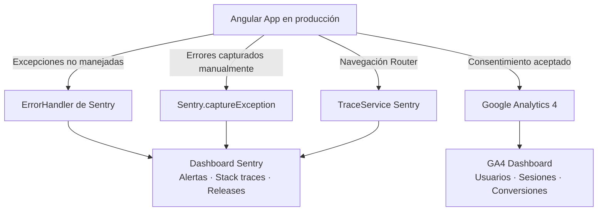

# Capítulo 35 - Parte 4: Monitoreo, error tracking con Sentry y analytics

> **Parte 4 de 4** · Capítulo 35 · PARTE XIV - Arquitectura y Patrones Avanzados

Desplegar en producción es solo el comienzo. Una app en producción sin monitoreo es como conducir con los ojos cerrados: no sabes cuándo algo falla ni cómo los usuarios interactúan con ella. En esta parte implementamos dos capas complementarias: **Sentry** para capturar errores y medir el rendimiento, y **Google Analytics 4** para entender el comportamiento del usuario.

## Sentry: error tracking y performance monitoring

Sentry intercepta excepciones no manejadas, las enriquece con contexto (stack trace, información del navegador, ruta activa, acciones previas del usuario) y las envía a un dashboard centralizado. La integración con Angular usa el `ErrorHandler` nativo.

### Instalación e inicialización

```bash
npm install @sentry/angular
```

La inicialización debe ocurrir lo antes posible, antes del bootstrap de Angular:

```typescript
// main.ts
import * as Sentry from '@sentry/angular';
import { bootstrapApplication } from '@angular/platform-browser';
import { appConfig } from './app/app.config';
import { AppComponent } from './app/app.component';
import { isDevMode } from '@angular/core';

Sentry.init({
  // El DSN identifica tu proyecto en Sentry (no es un secreto, va en el cliente)
  dsn: 'https://xxxxxxxx@o000000.ingest.sentry.io/0000000',

  // Solo monitorear en producción
  enabled: !isDevMode(),

  // Capturar el 10% de las transacciones para performance (ajustar según volumen)
  tracesSampleRate: 0.1,

  // Integración con el router de Angular para breadcrumbs de navegación
  integrations: [
    Sentry.browserTracingIntegration(),
  ],

  // Asociar el release con el hash de git para ver qué versión tiene el error
  release: `mi-app@${process.env['APP_VERSION'] ?? '1.0.0'}`,
  environment: 'production',
});

bootstrapApplication(AppComponent, appConfig).catch(console.error);
```

### Configuración en app.config.ts

```typescript
// app.config.ts
import { ApplicationConfig, ErrorHandler, inject } from '@angular/core';
import { Router } from '@angular/router';
import { provideRouter } from '@angular/router';
import * as Sentry from '@sentry/angular';
import { rutas } from './app.routes';

export const appConfig: ApplicationConfig = {
  providers: [
    provideRouter(rutas),

    // Reemplaza el ErrorHandler de Angular con el de Sentry
    // Captura automáticamente todas las excepciones no manejadas
    {
      provide: ErrorHandler,
      useValue: Sentry.createErrorHandler({ showDialog: false }),
    },

    // Necesario para que Sentry conecte las transacciones con el router
    {
      provide: Sentry.TraceService,
      deps: [Router],
    },
  ],
};
```

### Captura manual de errores

Para errores esperados que quieres reportar sin lanzar una excepción:

```typescript
import * as Sentry from '@sentry/angular';

export class ProductosService {
  async cargarProducto(id: number): Promise<Producto | null> {
    try {
      return await this.http.get<Producto>(`/api/productos/${id}`).toPromise();
    } catch (error) {
      // Capturar con contexto adicional
      Sentry.withScope(scope => {
        scope.setTag('seccion', 'catalogo');
        scope.setExtra('productoId', id);
        scope.setUser({ id: this.authService.usuarioId() });
        Sentry.captureException(error);
      });
      return null;
    }
  }
}
```

### Ocultar datos sensibles

Nunca dejes que datos personales lleguen a Sentry sin filtrar:

```typescript
Sentry.init({
  dsn: '...',
  // Remover datos sensibles antes de enviar
  beforeSend(evento) {
    // No enviar errores de red genéricos (muy ruidosos)
    if (evento.exception?.values?.[0]?.type === 'NetworkError') {
      return null;
    }
    // Sanitizar headers de autorización
    if (evento.request?.headers) {
      delete evento.request.headers['Authorization'];
    }
    return evento;
  },
});
```

## Google Analytics 4: comportamiento del usuario

GA4 registra eventos de interacción (páginas vistas, clics, conversiones) para entender qué hacen los usuarios y qué no. En Angular, el desafío es que GA4 fue diseñado para apps con recargas de página completa, pero Angular es una SPA.

### Patrón: servicio de analytics desacoplado

Envolver GA4 en un servicio propio tiene dos ventajas: permite cambiar de proveedor sin tocar el resto de la app, y facilita cumplir con GDPR (no inicializar hasta que el usuario acepte cookies).

```typescript
// analytics.service.ts
import { Injectable, inject } from '@angular/core';
import { NavigationEnd, Router } from '@angular/router';
import { filter } from 'rxjs/operators';

declare function gtag(...args: unknown[]): void;

@Injectable({ providedIn: 'root' })
export class AnalyticsService {
  private habilitado = false;
  private router = inject(Router);

  inicializar(idMedicion: string): void {
    if (this.habilitado) return;
    this.habilitado = true;

    // Cargar el script de GA4 dinámicamente (solo tras consentimiento)
    const script = document.createElement('script');
    script.src = `https://www.googletagmanager.com/gtag/js?id=${idMedicion}`;
    script.async = true;
    document.head.appendChild(script);

    // Configuración inicial
    window.dataLayer = window.dataLayer || [];
    gtag('js', new Date());
    gtag('config', idMedicion, { send_page_view: false });

    // Registrar page views en cada navegación de Angular Router
    this.router.events
      .pipe(filter(e => e instanceof NavigationEnd))
      .subscribe((e: NavigationEnd) => {
        gtag('event', 'page_view', { page_path: e.urlAfterRedirects });
      });
  }

  registrarEvento(nombre: string, parametros: Record<string, unknown> = {}): void {
    if (!this.habilitado) return;
    gtag('event', nombre, parametros);
  }
}
```

### Integración con consentimiento de cookies (GDPR)

```typescript
// cookie-consent.component.ts
import { Component, inject } from '@angular/core';
import { AnalyticsService } from '../core/services/analytics.service';

@Component({
  selector: 'app-cookie-consent',
  standalone: true,
  template: `
    @if (mostrarBanner()) {
      <div class="cookie-banner">
        <p>Usamos cookies para mejorar tu experiencia.</p>
        <button (click)="aceptar()">Aceptar</button>
        <button (click)="rechazar()">Rechazar</button>
      </div>
    }
  `,
})
export class CookieConsentComponent {
  private analytics = inject(AnalyticsService);
  mostrarBanner = signal(!localStorage.getItem('cookie-consent'));

  aceptar(): void {
    localStorage.setItem('cookie-consent', 'true');
    this.mostrarBanner.set(false);
    // Solo inicializar analytics tras aceptación explícita
    this.analytics.inicializar('G-XXXXXXXXXX');
  }

  rechazar(): void {
    localStorage.setItem('cookie-consent', 'false');
    this.mostrarBanner.set(false);
  }
}
```

### Eventos de negocio personalizados

```typescript
// En un componente de e-commerce
export class ProductoDetalleComponent {
  private analytics = inject(AnalyticsService);

  agregarAlCarrito(producto: Producto): void {
    this.carritoService.agregar(producto);

    // Evento GA4 de e-commerce
    this.analytics.registrarEvento('add_to_cart', {
      currency: 'USD',
      value: producto.precio,
      items: [{ item_id: producto.id, item_name: producto.nombre }],
    });
  }
}
```

## Arquitectura completa de observabilidad



## Puntos clave

- `Sentry.init()` debe ejecutarse en `main.ts` antes del bootstrap de Angular
- `Sentry.createErrorHandler()` reemplaza el `ErrorHandler` de Angular para captura automática
- `beforeSend` permite filtrar eventos ruidosos y sanitizar datos sensibles antes de enviarlos
- En SPAs, GA4 necesita rastrear `NavigationEnd` del Router para registrar los page views correctamente
- Nunca inicializar analytics hasta que el usuario acepte explícitamente (GDPR, LGPD)

## ¿Qué sigue?

En el Capítulo 36 cubrimos las novedades de Angular 20 y 21: `@let` en templates, signal-based queries, `linkedSignal()` y `resource()` estables, hydratación incremental, modos de renderizado por ruta y el camino a Zoneless estable.
