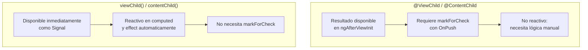

# Capítulo 36 — Parte 1: `@let` en templates y signal-based queries

> **Parte 1 de 4** · Capítulo 36 · PARTE XV — Angular 20 y el Futuro del Framework

Angular 20, lanzado en mayo de 2025, consolidó dos características que transforman la forma de escribir templates y consultar el DOM: la declaración de variables con `@let` y las signal-based queries que reemplazan a `@ViewChild` y `@ContentChild` con la ergonomía de los Signals.

## Declaración de variables con `@let`

Antes de Angular 20, el único modo de crear variables locales en un template era el poco intuitivo `*ngLet` de terceros o el abuso de `async pipe` con `as`. La nueva sintaxis `@let` es limpia, declarativa y funciona dentro de cualquier bloque de control de flujo:

```html
<!-- Template de un componente de perfil -->
@let usuario = authService.usuario();
@let nombreCompleto = usuario.nombre + ' ' + usuario.apellido;
@let esAdmin = usuario.roles.includes('admin');

<header>
  <h1>Bienvenido, {{ nombreCompleto }}</h1>
  @if (esAdmin) {
    <span class="badge-admin">Administrador</span>
  }
</header>

@let pedidosRecientes = pedidosService.pedidos() | slice:0:5;
@for (pedido of pedidosRecientes; track pedido.id) {
  <app-tarjeta-pedido [pedido]="pedido" />
}
```

Las variables declaradas con `@let` son:
- **Reactivas**: si el valor de la derecha es un Signal o un pipe `async`, se recalculan automáticamente en cada detección de cambios.
- **Locales al bloque**: una variable declarada dentro de `@if` no es visible fuera de él.
- **De solo lectura**: no se pueden reasignar desde el template ni desde la clase.

```html
<!-- @let dentro de bloques — el scope es el bloque que la contiene -->
@if (producto(); as p) {
  @let descuento = p.precio * 0.1;
  <p>Precio con descuento: {{ p.precio - descuento | currency }}</p>
}
<!-- "descuento" no es accesible aquí -->
```

El caso de uso más valioso es evitar llamadas repetidas a métodos o Signals costosos dentro del template:

```html
<!-- Sin @let: httpResource().value() se llama tres veces -->
<p>{{ productosResource.value()?.total }}</p>
<ul>@for (p of productosResource.value()?.items; track p.id) { ... }</ul>

<!-- Con @let: se llama una vez, el resultado se reutiliza -->
@let datos = productosResource.value();
<p>{{ datos?.total }}</p>
<ul>@for (p of datos?.items ?? []; track p.id) { ... }</ul>
```

## Signal-based queries: viewChild, viewChildren, contentChild, contentChildren

Las queries basadas en decoradores (`@ViewChild`, `@ContentChild`) tienen un problema: el resultado no está disponible hasta `ngAfterViewInit`, y actualizarlo requiere `ChangeDetectorRef.markForCheck()` manualmente con OnPush. Las signal-based queries resuelven ambos problemas.

```typescript
import { Component, viewChild, viewChildren, ElementRef, QueryList } from '@angular/core';

@Component({
  selector: 'app-formulario',
  standalone: true,
  template: `
    <input #campoNombre type="text" />
    <input #campoClave  type="password" />
    <button #botonEnviar>Enviar</button>
  `,
})
export class FormularioComponent {
  // Signal que contiene la referencia (undefined si no existe en el DOM)
  campoNombre = viewChild<ElementRef<HTMLInputElement>>('campoNombre');
  botonEnviar = viewChild<ElementRef<HTMLButtonElement>>('botonEnviar');

  // Signal que contiene un array con todas las referencias
  todosLosCampos = viewChildren<ElementRef<HTMLInputElement>>('campoNombre, campoClave');

  enfocarPrimerCampo(): void {
    // No necesita ngAfterViewInit — el Signal ya tiene el valor
    this.campoNombre()?.nativeElement.focus();
  }

  deshabilitarBoton(): void {
    const boton = this.botonEnviar();
    if (boton) boton.nativeElement.disabled = true;
  }
}
```

La diferencia clave respecto a `@ViewChild` es que el resultado es un Signal tipado: `Signal<ElementRef | undefined>`. Esto permite usarlo en `computed()` y `effect()` de forma reactiva:

```typescript
import { Component, viewChild, ElementRef, effect } from '@angular/core';

@Component({ selector: 'app-canvas', standalone: true, template: `<canvas #lienzo></canvas>` })
export class CanvasComponent {
  lienzo = viewChild<ElementRef<HTMLCanvasElement>>('lienzo');

  constructor() {
    // effect() reacciona automáticamente cuando el canvas aparece o desaparece
    effect(() => {
      const canvas = this.lienzo();
      if (canvas) {
        // El canvas acaba de aparecer en el DOM
        this.inicializarWebGL(canvas.nativeElement);
      }
    });
  }

  private inicializarWebGL(canvas: HTMLCanvasElement): void {
    // ...
  }
}
```

### contentChild y contentChildren para proyección de contenido

Las queries de contenido proyectado también tienen su versión con Signals:

```typescript
import { Component, contentChild, contentChildren, ElementRef } from '@angular/core';
import { BotonesComponent } from './botones.component';

@Component({
  selector: 'app-modal',
  standalone: true,
  template: `
    <div class="modal-body"><ng-content /></div>
    <div class="modal-footer"><ng-content select="[acciones]" /></div>
  `,
})
export class ModalComponent {
  // Busca un único elemento hijo por tipo de componente
  botones = contentChild(BotonesComponent);

  // Busca todos los elementos con un selector de atributo
  accionesExtra = contentChildren<ElementRef>('[accion-extra]');
}
```

## Comparativa: decoradores vs signal queries



| Característica | `@ViewChild` | `viewChild()` |
|---|---|---|
| Disponibilidad | Desde `ngAfterViewInit` | Inmediata (Signal) |
| Reactivo en `computed` | No | Sí |
| Compatible con `effect` | No | Sí |
| Tipo del resultado | `T \| undefined` | `Signal<T \| undefined>` |
| Requiere `markForCheck` con OnPush | Sí | No |

La recomendación para código nuevo en Angular 20+ es usar siempre `viewChild()` y `contentChild()`. Los decoradores siguen funcionando pero quedan como API legada.

## Puntos clave

- `@let variable = expresion` declara variables locales reactivas en templates, eliminando repetición y mejorando la legibilidad
- Las variables `@let` tienen scope del bloque en que se declaran y son de solo lectura
- `viewChild()` y `viewChildren()` retornan Signals, disponibles inmediatamente sin esperar `ngAfterViewInit`
- Las signal queries son reactivas en `computed()` y `effect()` sin necesidad de `markForCheck()`
- `contentChild()` y `contentChildren()` son las versiones para contenido proyectado con `ng-content`

## ¿Qué sigue?

En la Parte 2 cubrimos `linkedSignal()` estable y las APIs `resource()` y `httpResource()` que pasaron a developer preview en Angular 20.
