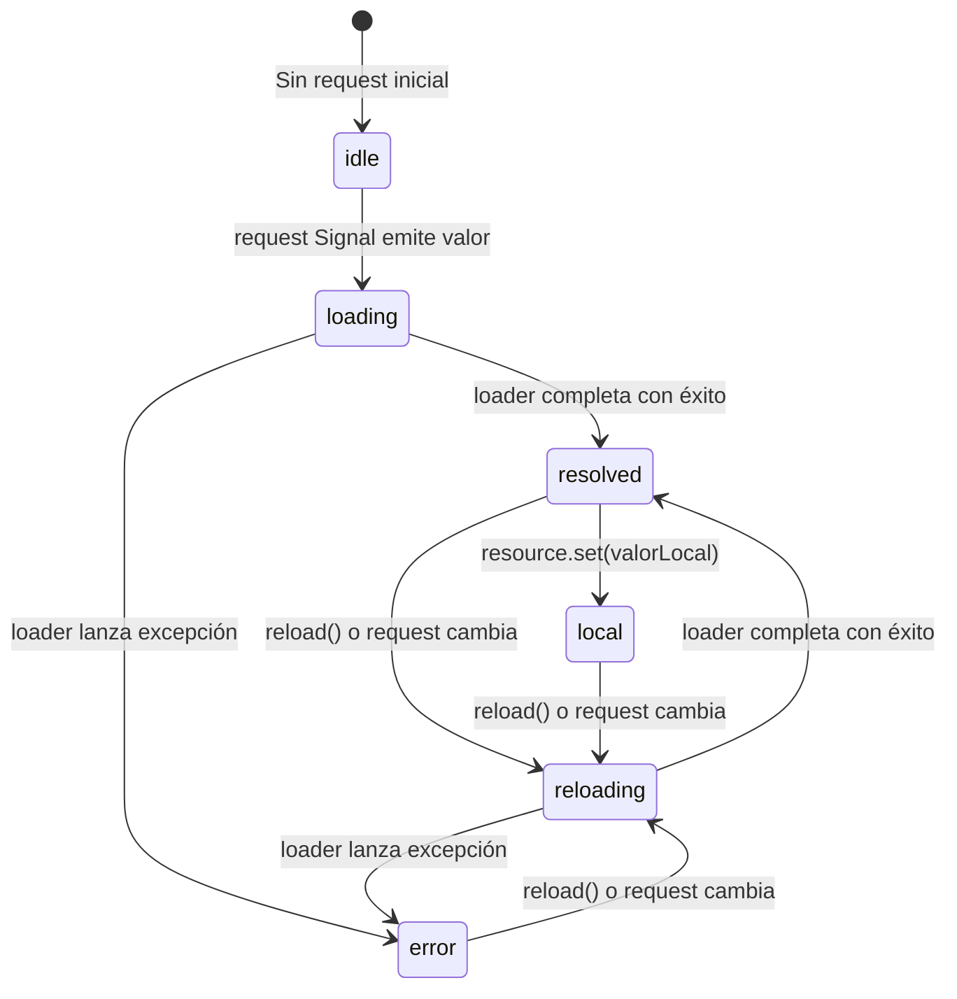

# Capítulo 36 - Parte 2: linkedSignal(), resource() y httpResource() en Angular 20

> **Parte 2 de 4** · Capítulo 36 · PARTE XV - Angular 20 y el Futuro del Framework

Angular 20 graduó tres APIs que estuvieron en fase experimental durante Angular 18 y 19: `linkedSignal()`, `resource()` y `httpResource()`. Con su promoción a *developer preview* (y algunos ya estables), el equipo de Angular señala que las APIs son estables y que el ecosistema puede empezar a adoptarlas con confianza en proyectos de producción.

→ Ver Capítulo 20, Parte 2 para la introducción inicial a estas APIs.

## linkedSignal(): estado derivado con escritura

Un Signal derivado con `computed()` es de solo lectura: no se puede sobreescribir su valor manualmente. `linkedSignal()` llena ese hueco: es un Signal escribible cuyo valor por defecto se recalcula cuando cambia su fuente, pero que también puede sobreescribirse manualmente.

El caso de uso canónico es un campo de formulario que tiene un valor por defecto proveniente de una fuente reactiva (una API, otro Signal) pero que el usuario puede editar:

```typescript
import { Component, signal, linkedSignal } from '@angular/core';
import { ProductosService } from '../services/productos.service';

@Component({
  selector: 'app-editor-producto',
  standalone: true,
  template: `
    <input
      [value]="nombreEditado()"
      (input)="nombreEditado.set($event.target.value)"
    />
    <button (click)="restaurar()">Restaurar valor original</button>
  `,
})
export class EditorProductoComponent {
  productoSeleccionado = signal<Producto | null>(null);

  // Cuando productoSeleccionado cambia, nombreEditado se resetea al nombre del producto.
  // Pero el usuario puede editarlo sin que se pierda al siguiente tick.
  nombreEditado = linkedSignal(() => this.productoSeleccionado()?.nombre ?? '');

  restaurar(): void {
    // Forzar recalculo: limpiar el override manual y volver al valor derivado
    this.nombreEditado.set(this.productoSeleccionado()?.nombre ?? '');
  }
}
```

La diferencia respecto a `computed()` es que `nombreEditado` admite `.set()` y `.update()`. La diferencia respecto a `signal()` normal es que cuando `productoSeleccionado` cambia de valor, `nombreEditado` se reinicia automáticamente al nuevo nombre del producto, descartando cualquier edición manual previa.

### Opción avanzada: control total con source y computation

Para casos donde necesitas más control sobre cuándo y cómo se resetea el Signal enlazado:

```typescript
// linkedSignal con API explícita de source + computation
cantidadSeleccionada = linkedSignal<Producto | null, number>({
  source: this.productoSeleccionado,
  computation: (producto, anterior) => {
    // Si cambia el producto, resetear a 1
    // Si el anterior era null, usar 1; si no, conservar la cantidad previa
    return producto ? (anterior?.value ?? 1) : 0;
  },
});
```

## resource(): datos asíncronos declarativos

`resource()` modela la carga de datos asíncronos como un grafo reactivo. En lugar de gestionar manualmente los estados `cargando`, `error` y `datos`, `resource()` lo hace por ti en función de un Signal de solicitud:

```typescript
import { Component, signal, resource } from '@angular/core';

@Component({
  selector: 'app-detalle-pedido',
  standalone: true,
  template: `
    @if (pedidoResource.isLoading()) {
      <app-skeleton />
    } @else if (pedidoResource.error()) {
      <app-error [mensaje]="pedidoResource.error()?.message" />
    } @else {
      <app-detalle [pedido]="pedidoResource.value()" />
      <button (click)="pedidoResource.reload()">Actualizar</button>
    }
  `,
})
export class DetallePedidoComponent {
  pedidoId = signal<number | null>(null);

  pedidoResource = resource({
    // Cuando pedidoId cambia, el loader se re-ejecuta automáticamente
    request: () => this.pedidoId(),

    // El loader recibe el valor del request signal
    loader: async ({ request: id }) => {
      if (!id) return null;
      const respuesta = await fetch(`/api/pedidos/${id}`);
      if (!respuesta.ok) throw new Error(`Error ${respuesta.status}`);
      return respuesta.json() as Promise<Pedido>;
    },
  });

  seleccionarPedido(id: number): void {
    this.pedidoId.set(id);
    // pedidoResource recarga automáticamente
  }
}
```

Los Signals disponibles en el objeto `resource`:
- `resource.value()` - el dato cargado (o `undefined` si no hay dato aún)
- `resource.isLoading()` - `true` mientras el loader está en progreso
- `resource.error()` - el error capturado (o `undefined` si no hay error)
- `resource.status()` - `'idle' | 'loading' | 'reloading' | 'resolved' | 'error' | 'local'`
- `resource.reload()` - método para forzar una nueva carga
- `resource.set(valor)` - sobreescribe el valor localmente sin recargar (estado `'local'`)

## httpResource(): resource integrado con HttpClient

`httpResource()` es una versión especializada de `resource()` que usa `HttpClient` en lugar de `fetch`, aprovechando el sistema de interceptores de Angular:

```typescript
import { Component, signal } from '@angular/core';
import { httpResource } from '@angular/core';  // Angular 20+

interface Producto {
  id: number;
  nombre: string;
  precio: number;
}

@Component({
  selector: 'app-catalogo',
  standalone: true,
  template: `
    @let datos = productosResource.value();
    @if (productosResource.isLoading()) { <app-spinner /> }
    @for (producto of datos ?? []; track producto.id) {
      <app-tarjeta-producto [producto]="producto" />
    }
  `,
})
export class CatalogoComponent {
  filtro = signal('');

  productosResource = httpResource<Producto[]>(() => ({
    url: '/api/productos',
    // Los params se recalculan reactivamente cuando filtro() cambia
    params: { q: this.filtro(), limite: '20' },
  }));
}
```

`httpResource()` pasa la solicitud por los interceptores de Angular (autenticación JWT, loading global, manejo de errores), hereda `TransferState` para SSR automáticamente, y respeta la configuración de `provideHttpClient`.

## Diagrama de estados de resource()



## Cuándo usar cada API

| Necesidad | Solución recomendada |
|---|---|
| Campo de formulario con valor por defecto reactivo | `linkedSignal()` |
| Datos de una API con fetch nativo | `resource()` |
| Datos de una API usando interceptores Angular | `httpResource()` |
| Streams complejos con combinación de Observables | RxJS + `toSignal()` |
| Estado local sin origen asíncrono | `signal()` + `computed()` |

## Puntos clave

- `linkedSignal()` es un Signal escribible cuyo valor se resetea cuando cambia su Signal fuente
- Ideal para campos de formulario con valores por defecto reactivos que el usuario puede editar
- `resource()` modela el ciclo completo de una petición asíncrona como un grafo de Signals
- `httpResource()` es `resource()` integrado con `HttpClient` e interceptores de Angular
- Ambas APIs tienen `isLoading()`, `error()`, `value()`, `reload()` y `set()` como interfaz pública

## ¿Qué sigue?

En la Parte 3 exploramos la hydratación incremental estable y el nuevo sistema de modos de renderizado por ruta que Angular 20 introdujo como reemplazo de la configuración en `angular.json`.
