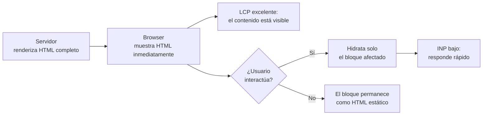

# Capítulo 36 - Parte 3: Hydratación incremental y modos de renderizado por ruta

> **Parte 3 de 4** · Capítulo 36 · PARTE XV - Angular 20 y el Futuro del Framework

Angular 20 estabilizó dos características que cambian profundamente cómo se define el SSR en una aplicación: la **hydratación incremental** y los **modos de renderizado por ruta**. Juntas permiten que cada ruta de la aplicación tenga su propia estrategia -CSR, SSR o SSG- declarada directamente en el archivo de rutas del servidor, sin tocar `angular.json`.

→ Ver Capítulo 27 para los conceptos base de SSR, hydration y SSG.

## Hydratación incremental con @defer

La hydratación clásica (`provideClientHydration()`) hidrata toda la aplicación de una vez al cargar. La hydratación incremental, estabilizada en Angular 20, permite que cada bloque `@defer` en el template se hidrate de forma independiente, basándose en triggers reales del usuario o del viewport.

```typescript
// app.config.ts - habilitar hydratación incremental
import { provideClientHydration, withIncrementalHydration } from '@angular/platform-browser';

export const appConfig: ApplicationConfig = {
  providers: [
    provideClientHydration(
      withIncrementalHydration(), // Activa la hydratación por bloques
    ),
  ],
};
```

Con `withIncrementalHydration()` activo, los bloques `@defer` pueden tener triggers de hydratación separados de sus triggers de carga:

```html
<!-- El contenido se pre-renderiza en el servidor (visible inmediatamente) -->
<!-- pero NO se hidrata hasta que el usuario interactúa con él -->

@defer (hydrate on interaction) {
  <!-- Este bloque es "HTML estático" hasta que el usuario hace clic -->
  <app-carrusel-productos [productos]="destacados" />
}

@defer (hydrate on viewport) {
  <!-- Se hidrata cuando el usuario hace scroll hasta aquí -->
  <app-seccion-resenas />
}

@defer (hydrate when usuarioAutenticado()) {
  <!-- Se hidrata cuando la condición Signal se vuelve true -->
  <app-panel-usuario />
}

@defer (hydrate never) {
  <!-- Nunca se hidrata: permanece como HTML estático puro -->
  <!-- Ideal para contenido puramente decorativo -->
  <app-footer-estatico />
}
```

El resultado es que la página carga con todo el HTML del servidor visible, pero el JavaScript de Angular solo se ejecuta para los bloques con los que el usuario realmente interactúa. Los bloques que nunca se hydrata son esencialmente HTML inerte - no hay escuchas de eventos, no hay detección de cambios.

### Impacto en métricas de rendimiento



## Modos de renderizado por ruta con app.routes.server.ts

Antes de Angular 20, la configuración de prerender y SSR era global en `angular.json`. El nuevo sistema permite que cada ruta declare su propio modo de renderizado en un archivo específico del servidor:

```typescript
// app.routes.server.ts - solo se ejecuta en el servidor de Node
import { RenderMode, ServerRoute } from '@angular/ssr';

export const serverRoutes: ServerRoute[] = [
  {
    // La landing page se pre-renderiza en build time (SSG)
    path: '',
    renderMode: RenderMode.Prerender,
  },
  {
    // El blog se pre-renderiza con todas sus rutas conocidas
    path: 'blog/:slug',
    renderMode: RenderMode.Prerender,
    // Función async que devuelve los params de todas las rutas a generar
    async getPrerenderParams() {
      const articulos = await fetch('https://api.example.com/blog').then(r => r.json());
      return articulos.map((a: { slug: string }) => ({ slug: a.slug }));
    },
  },
  {
    // El dashboard requiere autenticación: SSR en cada request
    path: 'dashboard/**',
    renderMode: RenderMode.Server,
  },
  {
    // La tienda usa SSR para SEO de productos
    path: 'tienda/:categoria',
    renderMode: RenderMode.Server,
  },
  {
    // El área de cuenta es privada sin valor de SEO: CSR puro
    path: 'cuenta/**',
    renderMode: RenderMode.Client,
  },
];
```

El `RenderMode` enum tiene tres valores:
- **`RenderMode.Prerender`**: genera HTML estático en build time (SSG). Más rápido en producción, ideal para contenido que cambia poco.
- **`RenderMode.Server`**: renderiza en el servidor en cada request (SSR). Necesario para contenido dinámico o personalizado.
- **`RenderMode.Client`**: renderiza solo en el cliente (CSR). Idóneo para rutas privadas sin valor de SEO.

### Conectar el archivo al builder

```json
// angular.json - apuntar al nuevo archivo de rutas del servidor
{
  "server": "src/app/app.routes.server.ts"
}
```

Angular CLI detecta automáticamente `app.routes.server.ts` si sigue la convención de nombre; en caso contrario, se especifica en `angular.json`.

## Hot Module Replacement (HMR) mejorado

Angular 20 habilitó HMR por defecto en modo desarrollo. A diferencia del live reload clásico (que recargaba toda la página), HMR reemplaza solo el módulo que cambió:

```bash
# Angular 20+: HMR activo por defecto
ng serve

# Para deshabilitarlo explícitamente si causa problemas:
ng serve --no-hmr
```

El HMR de Angular 20 preserva el estado de los Signals y el store NgRx entre cambios de componentes. Esto significa que al editar el template de un componente, los datos ya cargados permanecen y solo se re-renderiza lo que cambió.

### Límites del HMR actual

- Los cambios en `app.config.ts` o proveedores globales siguen requiriendo recarga completa
- Los cambios en servicios singleton reinician ese servicio (el estado se pierde)
- Los cambios en rutas también requieren recarga

## Puntos clave

- `withIncrementalHydration()` activa la hydratación por bloques `@defer` en lugar de hidratar toda la app de una vez
- Los triggers de hydratación (`on interaction`, `on viewport`, `when condición`, `never`) definen cuándo se activa el JavaScript de cada bloque
- `app.routes.server.ts` con `ServerRoute[]` reemplaza la configuración de SSR/SSG en `angular.json`
- `RenderMode.Prerender` (SSG), `RenderMode.Server` (SSR) y `RenderMode.Client` (CSR) se mezclan por ruta en el mismo proyecto
- HMR está habilitado por defecto en `ng serve` desde Angular 20, preservando el estado de Signals entre cambios

## ¿Qué sigue?

En la Parte 4 cerramos con Zoneless change detection en developer preview, las novedades de Angular 21 y el roadmap del framework.
