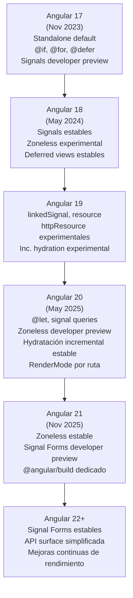

# Capítulo 36 — Parte 4: Zoneless, Angular 21 y el roadmap del framework

> **Parte 4 de 4** · Capítulo 36 · PARTE XV — Angular 20 y el Futuro del Framework

Con Angular 20 consolidando Signals, SSR por ruta e hydratación incremental, y Angular 21 cerrando el ciclo hacia un Angular completamente libre de Zone.js, el framework entra en una de las etapas más significativas de su historia. Esta parte resume el estado actual de Zoneless, las novedades confirmadas de Angular 21 y la dirección que toma el ecosistema.

## Zoneless en developer preview (Angular 20)

Angular 20 promovió Zoneless change detection de _experimental_ a **developer preview**, el estado anterior a estable. Esto significa que la API pública está consolidada y que el equipo de Angular se compromete a no introducir cambios rupturistas antes de graduarla a estable.

→ Ver Capítulo 25, Parte 4 para la introducción a Zoneless.

```typescript
// app.config.ts — Zoneless en Angular 20 (developer preview)
import { provideExperimentalZonelessChangeDetection } from "@angular/core";

export const appConfig: ApplicationConfig = {
  providers: [
    // En Angular 20, el nombre aún incluye "Experimental" por compatibilidad hacia atrás
    // pero la API es estable. Angular 21 lo renombra a provideZonelessChangeDetection()
    provideExperimentalZonelessChangeDetection(),
  ],
};
```

```json
// angular.json — quitar zone.js de polyfills para Zoneless completo
{
  "polyfills": []
}
```

### Checklist de compatibilidad con Zoneless actualizado (Angular 20)

Con Angular 20, la mayoría de las APIs internas ya son compatibles con Zoneless:

| Característica                                   | Compatible con Zoneless             |
| ------------------------------------------------ | ----------------------------------- |
| Signals (`signal`, `computed`, `effect`)         | ✅ Sí                               |
| `async pipe`                                     | ✅ Sí                               |
| `HttpClient` con `httpResource`                  | ✅ Sí                               |
| Formularios reactivos                            | ✅ Sí                               |
| Angular Material 20                              | ✅ Sí                               |
| `setTimeout` / `setInterval` sin Signal          | ⚠️ Requiere `markForCheck()` manual |
| Librerías de terceros que usen Zone internamente | ⚠️ Depende de la librería           |
| `NgZone.run()` explícito                         | ❌ No aplica (no hay NgZone)        |

## Angular 21: estabilización y cierre del ciclo

Angular 21, lanzado en noviembre de 2025, se centró en tres ejes: **estabilizar lo que estaba en preview**, **mejorar el tooling** y **simplificar la superficie de la API**.

### Zoneless estable

La principal novedad de Angular 21 es la graduación de Zoneless a estable, renombrando la función de provisión:

```typescript
// Angular 21 — nombre estable, sin el prefijo "Experimental"
import { provideZonelessChangeDetection } from "@angular/core";

export const appConfig: ApplicationConfig = {
  providers: [
    provideZonelessChangeDetection(),
    // ...resto de providers
  ],
};
```

El paquete `zone.js` puede eliminarse completamente del `package.json` en proyectos Zoneless de Angular 21.

### Signal-based forms (developer preview en Angular 21)

Los formularios basados en Signals permiten definir el estado del formulario como un grafo reactivo sin `FormControl` ni `FormGroup` tradicionales:

```typescript
// Angular 21 — Signal Forms (developer preview)
import { signalForm, signalControl } from "@angular/forms";

export class LoginComponent {
  formulario = signalForm({
    email: signalControl("", {
      validators: [Validators.required, Validators.email],
    }),
    clave: signalControl("", { validators: [Validators.minLength(8)] }),
  });

  enviar(): void {
    if (this.formulario.valid()) {
      const { email, clave } = this.formulario.value();
      this.authService.login(email, clave);
    }
  }
}
```

```html
<!-- Template con signal forms -->
<form (ngSubmit)="enviar()">
  <input [formSignal]="formulario.controls.email" type="email" />
  @if (formulario.controls.email.errors()?.['email']) {
  <span>Correo inválido</span>
  }

  <input [formSignal]="formulario.controls.clave" type="password" />
  <button [disabled]="!formulario.valid()">Entrar</button>
</form>
```

Los Signal Forms son la respuesta a uno de los puntos de fricción históricos de Angular: la desconexión entre el estado reactivo del formulario y los Signals del resto de la aplicación.

### Mejoras en el CLI y tooling

Angular 21 introdujo `@angular/build` como paquete dedicado al builder basado en esbuild, separándolo de `@angular-devkit/build-angular`. Esto permite actualizaciones más frecuentes del tooling sin estar atado al ciclo de lanzamiento del core.

```bash
# Angular 21 — migración automática al nuevo paquete de build
ng update @angular/cli
# El migration schematic actualiza el builder en angular.json automáticamente
```

## El roadmap: hacia dónde va Angular



### Principios que guían la evolución

1. **Signals como capa de reactividad unificada**: el objetivo final es que toda la reactividad de Angular (formularios, queries, HTTP, estado) sea expresable con Signals, eliminando la asimetría entre RxJS y el sistema de detección de cambios.

2. **Zoneless como predeterminado**: en versiones futuras, nuevos proyectos se crearán sin Zone.js por defecto. Zone.js quedará como opción de compatibilidad hacia atrás.

3. **Reducir boilerplate sin reducir control**: `@let`, signal queries, `resource()` y Signal Forms eliminan código repetitivo sin ocultar la mecánica del framework.

4. **esbuild como único bundler**: la apuesta por esbuild y Native Federation reemplazará progresivamente el soporte de Webpack, que quedará para casos de compatibilidad.

## Migrando un proyecto existente a Angular 20/21

```bash
# Siempre migrar de una versión mayor a la siguiente, en orden
ng update @angular/core@20 @angular/cli@20

# Ejecutar los schematics de migración automática
ng update @angular/core@21 @angular/cli@21

# Verificar que no hay uso de APIs deprecadas
ng lint
```

Las guías de migración oficiales en `angular.dev` documentan cada API deprecada y su reemplazo. El comando `ng update` aplica la mayoría de las migraciones automáticamente con schematics.

## Puntos clave

- Zoneless change detection pasó de experimental (v17-19) a developer preview (v20) y estable (v21)
- Angular 21 renombra `provideExperimentalZonelessChangeDetection()` a `provideZonelessChangeDetection()`
- Signal Forms (developer preview en v21) unifican la reactividad de formularios con el sistema de Signals
- `@angular/build` se separa de `@angular-devkit/build-angular` para ciclos de release más ágiles del tooling
- La dirección del framework apunta a Signals como única capa de reactividad y Zoneless como predeterminado

## ¿Qué sigue?

Llegaste al final de la guía. Con estos 36 capítulos tienes las herramientas para construir, optimizar, testear y desplegar aplicaciones Angular modernas — desde el primer `ng new` hasta las últimas APIs de Angular 21.
